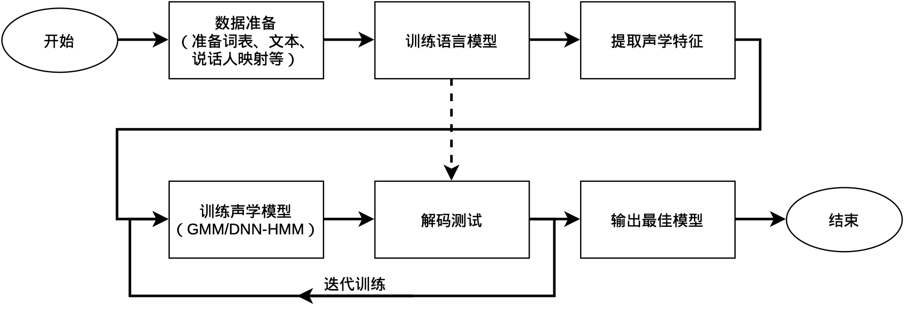

# Project 2：Description

本项目需要在给定10小时的中文数据集上，在交我算上利用助教已经安装好的Kaldi，搭建完整的语音识别系统，包括：

- 数据的处理
- 特征的提取
- GMM-HMM模型的训练
- 基于DNN-HMM的识别系统构建（选做）
- 测试集上的识别解码和评测

传统LVCSR系统的搭建流程如下图所示：


要求：

本次试验在交我算平台上完成，请不要使用别人的账号，登陆后请根据超算文档立即修改代码！SSH登陆方法为：

```
ssh username@pilogin.hpc.sjtu.edu.cn
```

（注意，用pilogin而不是sylogin集群进行登陆，两个集群不同。）
- 请在首次登陆超算节点后请从 /lustre/home/acct-stu/stu1854/kaldi/egs/aishell 将编译好的kaldi复制到自己的目录中进行实验，具体代码为：

```
cp -r /lustre/home/acct-stu/stu1854/kaldi/egs/aishell/s5 ~/aishell

cd ~/aishell

rm steps utils # 删除损坏的软链接

ln -s /lustre/home/acct-stu/stu1854/kaldi/egs/wsj/s5/steps ./

ln -s /lustre/home/acct-stu/stu1854/kaldi/egs/wsj/s5/utils ./
```

完成后，在~/aishell/目录中执行source path.sh操作，即可激活kaldi的环境。run.sh指明了系统搭建的全部操作，建议逐步骤运行。具体来说，“local/nnet3/run_tdnn.sh”和“local/chain/run_tdnn.sh”两个命令是用DNN-HMM进行识别系统的搭建和训练，其之上的所有代码是进行GMM-HMM系统的搭建和训练。GMM-HMM需要在CPU节点运行，而DNN-HMM需要在GPU节点运行。
- **请勿直接在登陆机器上运行训练、解码等资源消耗大的脚本！请通过超算的Slurm调度系统进行任务的提交（可以通过srun交互式运行，或sbatch提交任务，具体参照超算文档）。直接在登陆机器上占用大量CPU和内存情节严重的可能会被管理员封号。**
- AIShell数据集的路径在/lustre/home/acct-stu/stu1718/aishell_data，此路径已经在run.sh中指定，一般情况下不需要修改。
- 本项目中以字错误率（CER）作为最终评分标准，词错误率仅用作参考。在 recipe 目录下的 steps/scoring 目录中有相应的计算脚本。
- 报告模版在[https://latex.sjtu.edu.cn/read/phkhqrbfcdbt](https://latex.sjtu.edu.cn/read/phkhqrbfcdbt)下载。更详细的要求见模版。

提交文件为一个压缩包，命名格式为“Project3-学号-姓名.zip”，需要包含：
- 报告（中文），采用 LaTeX 编写，提交 PDF 格式。其中应当包含对于Kaldi运行全流程的理解、解读，所做的更改（如有），系统性能和必要的分析、思考。
- 一个可以运行的完整recipe，包含最终代码（即cmd.sh、conf、local、path.sh、run.sh），最终模型（一般名为final.mdl），以及请在recipe的run.sh同目录下添加README.txt文件，介绍所作修改（如有）、recipe使用方法和预期的最终模型所在目录。recipe中请勿包含数据集，中间数据或log文件。
- 两种预测结果(可以直接上传decode_test/scoring_kaldi/ 整个打包)文件。预测文件test_filt.txt与test_filt.chars.txt文件请选取你的字错误率最低的模型生成的预测结果，分别按词与按字分割。这些文件一般位于recipe目录下exp/.../decode_test/scoring_kaldi中。

提交日期：6.23（第十八周星期日）晚上23:59。

评分标准
占总成绩35%，得分由系统性能得分、报告得分两部分构成，其中15分为系统性能得分，20分为报告得分，有关报告的详细要求请参考报告模板。

---

交我算相关：  
本课程可以使用的cpu队列为cpu，gpu队列为dgx2（单卡拥有32G显存）。超算GPU资源紧张，可能需要排队等待任务，请合理安排作业时间。  
集群状态查询：https://status.hpc.sjtu.edu.cn/  
登录：https://docs.hpc.sjtu.edu.cn/login/index.html  
数据传输与访问：https://docs.hpc.sjtu.edu.cn/transport/index.html  
队列信息：https://docs.hpc.sjtu.edu.cn/system/computesystem.html  
作业提交：https://docs.hpc.sjtu.edu.cn/job/index.html  
预编译软件列表和使用：https://docs.hpc.sjtu.edu.cn/app/index.html