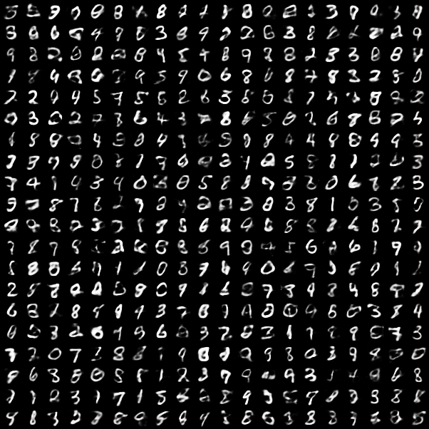
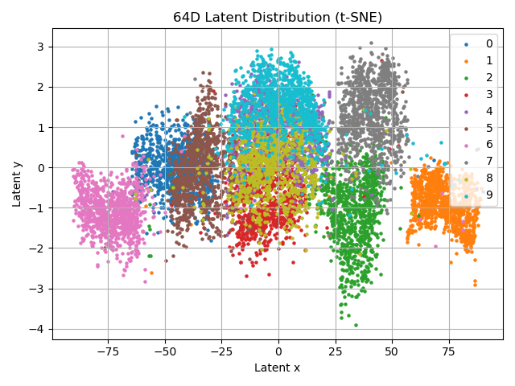
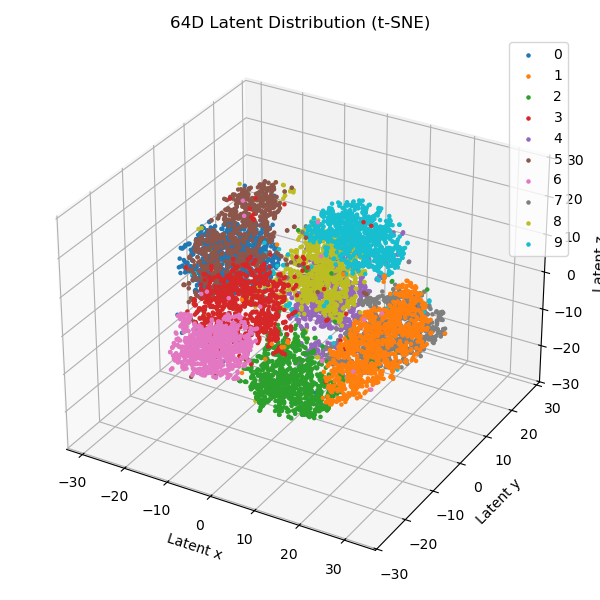

# VAE for Image Systhesis

## :hammer_and_wrench: Usage

### Installation

1. Create a new conda environment by running the following command.

```bash
conda create -n vae python=3.12.3
conda activate vae
```

2. Please first install [pytorch](https://pytorch.org/get-started/locally/) in its official site with appropriate version, e.g.

```bash
pip3 install torch torchvision torchaudio --index-url https://download.pytorch.org/whl/cu124
```

3. Install other dependencies
   
```bash
pip install tqdm numpy scikit-learn
```

4. It is optional to download the checkpoints of our model [checkpoints.zip](w.com) and place it under `./output`. Then, unzip the zip file, the checkpoints will be automatically classified into right dirctory.

### Training

If you have downloaded our checkpoints, it's not necessary to train a new model again. Otherwise, you can directly train the model with default setting by running

```bash
python main.py
```

All of our experiments can be reproduced by running the following command

```bash
./train.sh
```

The checkpoints and results will be saved in `./output` folder.

### Visualization

To better visualize the latent space in a 3D interactive interface, you can run the following command

```bash
./visualize.sh
```

## :star: Demos

### VAE Generation

<p align="center"> <a>

</a> </p>

### VAE Latent Space

<p align="center"> <a>

</a> </p>